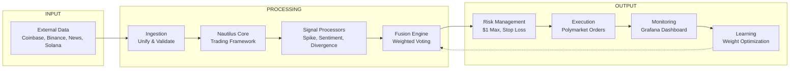

# 🤖 Polymarket BTC 15-Minute Trading Bot

[](https://www.python.org/downloads/)
[](https://nautilustrader.io/)
[](https://opensource.org/licenses/MIT)
[](https://polymarket.com)
[](https://redis.io/)
[](https://grafana.com/)

A production-grade algorithmic trading bot for **Polymarket's 15-minute BTC price prediction markets**. Built with a 7-phase architecture combining multiple signal sources, professional risk management, and self-learning capabilities.


---

## 📋 **Table of Contents**
- [Features](#features)
- [Architecture](#architecture)
- [Prerequisites](#prerequisites)
- [Quick Start](#quick-start)
- [Configuration](#configuration)
- [Running the Bot](#running-the-bot)
- [Monitoring](#monitoring)
- [Trading Modes](#trading-modes)
- [Project Structure](#project-structure)
- [Testing](#testing)
- [Contributing](#contributing)
- [FAQ](#faq)
- [License](#license)
- [Disclaimer](#disclaimer)

---

## ✨ **Features**

| Feature | Description |
|---------|-------------|
| **7-Phase Architecture** | Modular, testable, production-ready design |
| **Multi-Signal Intelligence** | Spike Detection, Sentiment Analysis, Price Divergence |
| **Risk-First Design** | $1 max per trade, 30% stop loss, 20% take profit |
| **Dual-Mode Operation** | Toggle between simulation and live without restart |
| **Real-Time Monitoring** | Grafana dashboards + Prometheus metrics |
| **Self-Learning** | Automatically optimizes signal weights based on performance |
| **Auto-Recovery** | WebSocket auto-reconnection, rate limiting, data validation |
| **Paper Trading** | Full P&L tracking in simulation mode |

---

## 🏗️ **Architecture**

### **7-Phase Overview**


## Prerequisites
- Python 3.14+ (Download)

- Redis (Download) - for mode switching

- Polymarket Account with API credentials
- Git

## 🚀 Quick Start

## 1. Clone the Repository

```bash
git clone https://github.com/yourusername/polymarket-btc-15m-bot.git
cd polymarket-btc-15m-bot
```
## 2. Set Up Virtual Environment

```bash
# Windows
python -m venv venv
venv\Scripts\activate

# macOS / Linux
python -m venv venv
source venv/bin/activate
```
## 3. Install Dependencies

```
bash
pip install -r requirements.txt
```
## 4. Configure Environment Variables
```
bash
cp .env.example .env
Edit .env with your credentials:

env
# Polymarket API Credentials
POLYMARKET_PK=your_private_key_here
POLYMARKET_API_KEY=your_api_key_here
POLYMARKET_API_SECRET=your_api_secret_here
POLYMARKET_PASSPHRASE=your_passphrase_here

# Redis Configuration
REDIS_HOST=localhost
REDIS_PORT=6379
REDIS_DB=2

# Trading Parameters
MAX_POSITION_SIZE=1.0
STOP_LOSS_PCT=0.30
TAKE_PROFIT_PCT=0.20
SPIKE_THRESHOLD=0.15
DIVERGENCE_THRESHOLD=0.05
```
## 5. Start Redis
```
bash
# Windows (download from redis.io)
redis-server

# macOS
brew install redis
redis-server

# Linux
sudo apt install redis-server
redis-server
```
## 6. Run the Bot
```
bash
# Test mode (trades every minute - for quick testing)
python run_bot.py --test-mode

# Live trading mode (REAL MONEY!)
python 15m_bot_runner.py --live
```
## ⚙️ Configuration Options
Argument	Description	Default
--test-mode	Trade every minute for testing	False
--live	Enable live trading (real money)	False
--no-grafana	Disable Grafana metrics	False
##View Paper Trades
```
bash
python view_paper_trades.py
```
## Trading Modes
Switch Modes Without Restarting (Redis)

# Switch to simulation mode (safe)
```
python redis_control.py sim -- not stable yet
```
# Switch to live trading mode (REAL MONEY!)
```
python redis_control.py live --not stable yet
``` 
## 📁 Project Structure

```text
polymarket-btc-15m-bot/
├── core/                        # Core business logic
│   ├── ingestion/               # Phase 2: Data ingestion
│   │   ├── adapters/            # Unified adapter interface
│   │   ├── managers/            # Rate limiter, WebSocket manager, etc.
│   │   └── validators/          # Data validation & schema checks
│   ├── nautilus_core/           # Phase 3: NautilusTrader integration
│   │   ├── data_engine/         # Nautilus data engine wrapper
│   │   ├── event_dispatcher/    # Event handling & dispatching
│   │   ├── instruments/         # BTC/USDT instrument definitions
│   │   └── providers/           # Custom live/historical data providers
│   └── strategy_brain/          # Phase 4: Signal generation & processing
│       ├── fusion_engine/       # Multi-signal combination logic
│       ├── signal_processors/   # Individual detectors (spike, divergence, sentiment…)
│       └── strategies/          # Main 15-minute BTC trading strategy
│
├── data_sources/                # Phase 1: External market & sentiment data
│   ├── binance/                 # Binance WebSocket client
│   ├── coinbase/                # Coinbase REST API client
│   ├── news_social/             # Fear & Greed Index + social sentiment
│   └── solana/                  # Solana RPC (optional / experimental)
│
├── execution/                   # Phase 5: Order placement & risk control
│   ├── execution_engine.py      # Main order execution coordinator
│   ├── polymarket_client.py     # Polymarket API wrapper & order logic
│   └── risk_engine.py           # Position sizing, SL/TP, exposure limits
│
├── monitoring/                  # Phase 6: Performance tracking & metrics
│   ├── grafana_exporter.py      # Prometheus metrics exporter
│   └── performance_tracker.py   # Trade logging & statistics
│
├── feedback/                    # Phase 7: Future learning / optimization
│   └── learning_engine.py       # Placeholder for ML feedback loop
│
├── grafana/                     # Grafana dashboard & configuration
│   ├── dashboard.json           # Pre-built dashboard definition
│   ├── grafana.ini              # Grafana server config (optional)
│   └── import_dashboard.py      # Script to import dashboard automatically
│
├── scripts/                     # Development & testing utilities
│   ├── test_data_sources.py
│   ├── test_ingestion.py
│   ├── test_nautilus.py
│   ├── test_strategy.py
│   └── test_execution.py
│
├── .env.example                 # Template for environment variables
├── .gitignore
├── patch_gamma_markets.py       # Temporary patch/fix for Polymarket API
├── redis_control.py             # Switch trading mode (sim/live/test)
├── requirements.txt             # Python dependencies
├── run_bot.py                   # Main bot entry point
├── view_paper_trades.py         # View simulation/paper trade history
└── README.md                    # This file
```
Testing
Run tests for each phase independently:

# Test individual phases
```
python scripts/test_data_sources.py
python scripts/test_ingestion.py
python scripts/test_nautilus.py
python scripts/test_strategy.py
python scripts/test_execution.py
```
🤝 Contributing
Contributions are welcome! Here's how you can help:

 - Fork the repository

 - Create a feature branch: git checkout -b feature

 -Commit your changes: git commit -m 'Added feature'

- Push to the branch: git push origin feature/added-feature

Open a Pull Request

## Ideas for Contributions
- Add derivatives data (funding rates, open interest)

- Implement more signal processors

- Add Telegram/Discord alerts

- Create web UI for management


- Support for ETH/SOL markets

- Machine learning optimization

## ❓ FAQ

**Q: How much money do I need to start?**  
**A:** The bot caps each trade at $1, so you can start with as little as $10–20.

**Q: Is this profitable?**  
**A:** Yes — in simulation testing it has shown good results (e.g. ~75% win rate in early runs).  
However, **past performance does not guarantee future results**. Always test thoroughly in simulation mode first.

**Q: Do I need programming experience?**  
**A:** Basic Python knowledge is helpful (e.g. understanding how to run scripts and edit config files), but the bot is designed to run with just a few simple commands — no coding required for normal use.

**Q: Can I run this 24/7?**  
**A:** Yes! The bot is built for continuous operation and includes basic auto-recovery features in case of temporary connection issues.

**Q: What's the difference between test mode and normal mode?**  
**A:**  
- **Test mode** — trades simulated every minute (great for quick testing and debugging)  
- **Normal mode** — trades every 15 minutes (matches the intended 15-minute strategy timeframe)

 
## Disclaimer
TRADING CRYPTOCURRENCIES CARRIES SIGNIFICANT RISK.

This bot is for educational purposes

Past performance does not guarantee future results

Always understand the risks before trading with real money

The developers are not responsible for any financial losses

Start with simulation mode, then small amounts, then scale up

## Acknowledgments
NautilusTrader - Professional trading framework

Polymarket - Prediction market platform


All contributors and users of this project

## Contact & Community
GitHub Issues: For bugs and feature requests

Twitter: @Kator07

##Discord: Join our community
- https://discord.gg/tafKjBnPEQ

## ⭐ Show Your Support
If you find this project useful, please star the GitHub repo! It helps others discover it.

## contact me on telegram 
 [](https://t.me/Bigg_O7)

